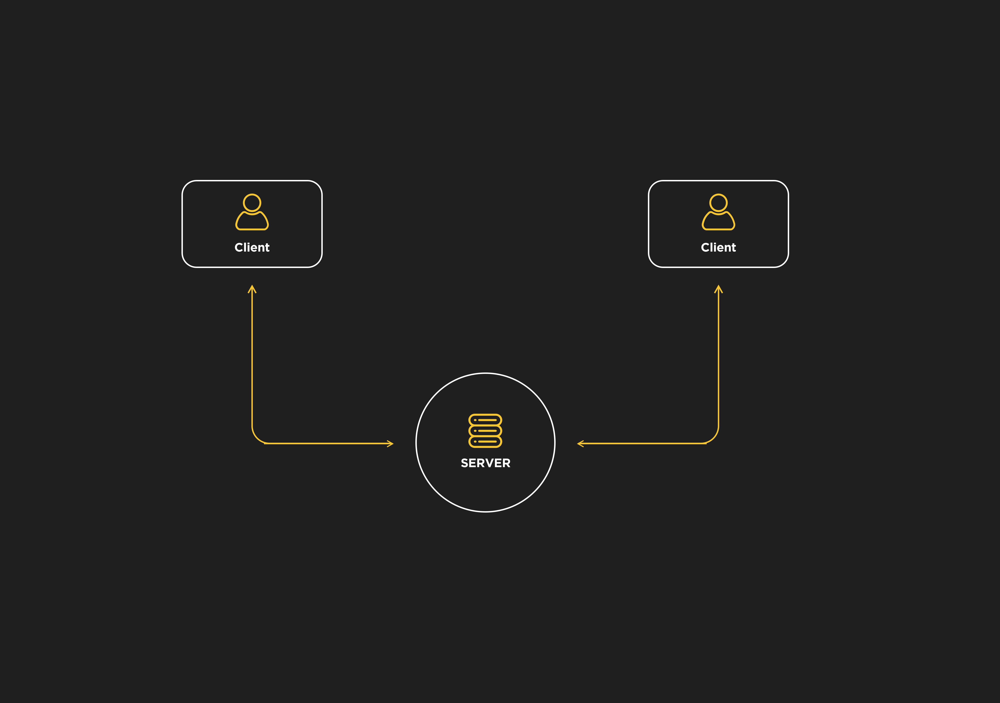
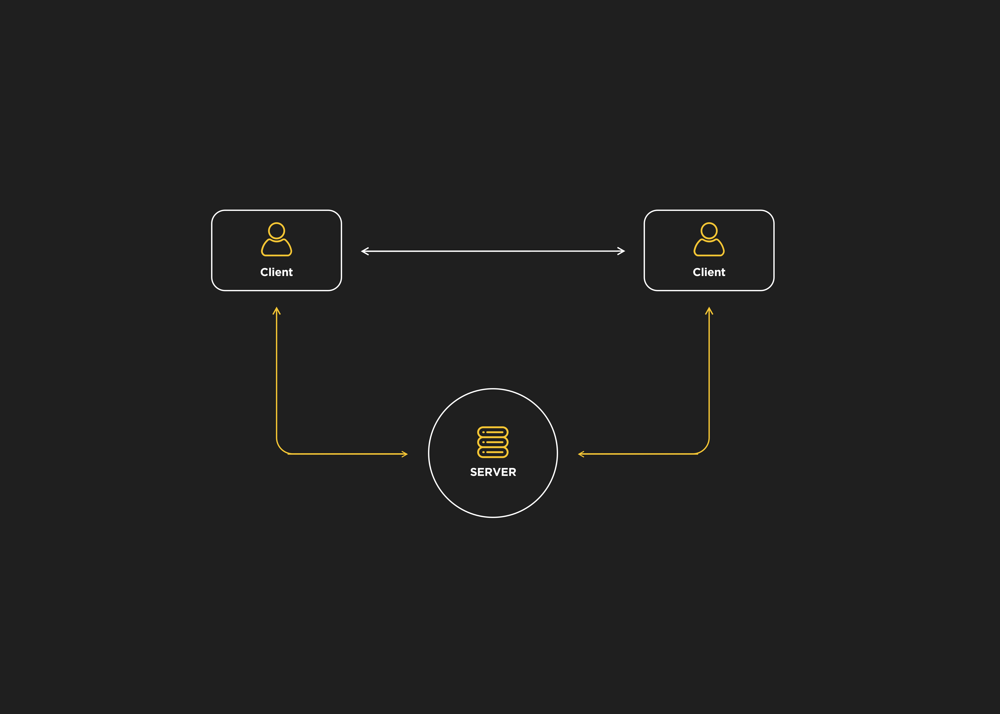
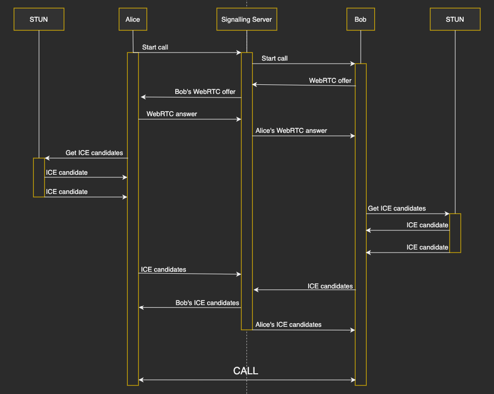
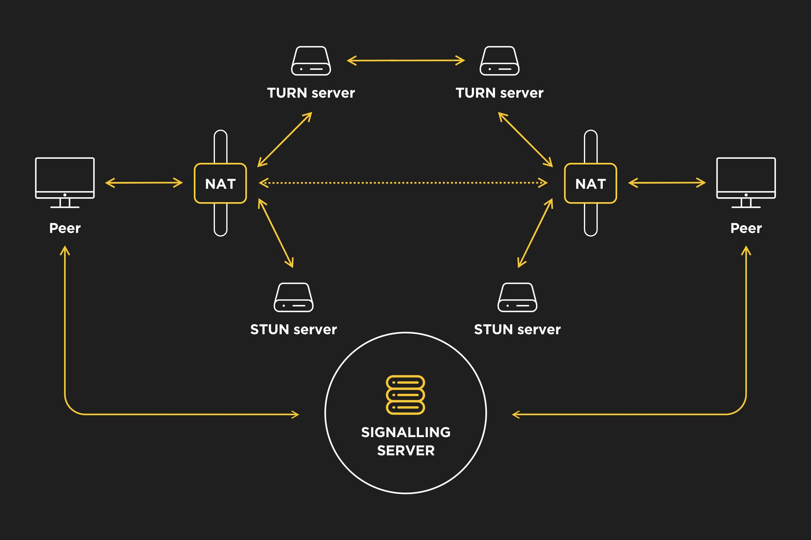
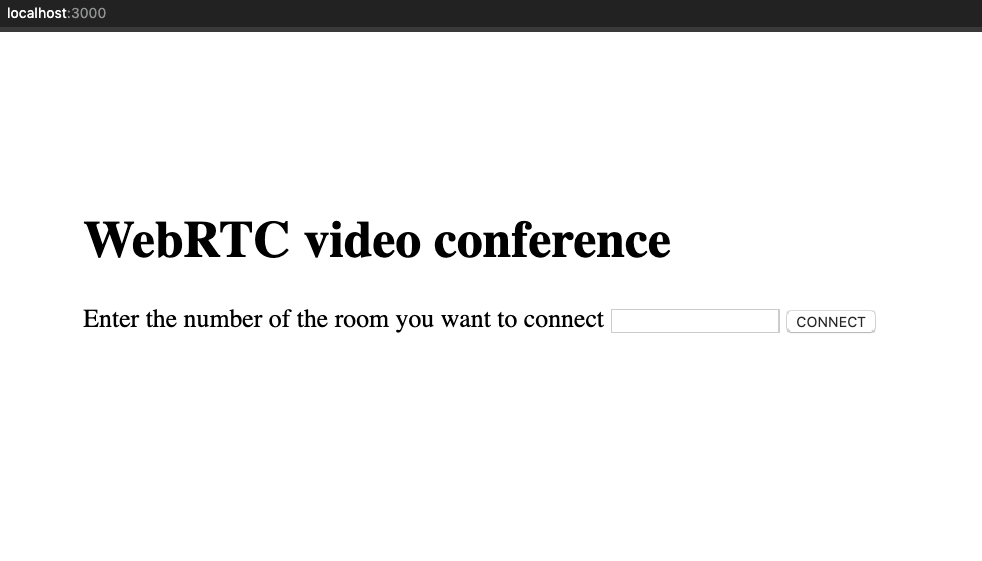

# How to Implement a Video Conference with WebRTC and Node

[WebRTC introduction](#webrtc-introduction)

[WebRTC APIs](#webrtc-apis)

[Implementation of a video conference with Node](#implementation-of-a-video-conference-with-node)

[Conclusion](#conclusion)

## WebRTC introduction

WebRTC (Web Real Time Communication) is an open source project that enables peer-to-peer communication between browsers. In other words, WebRTC allows you to exchange any kind of media through the web (such as video, audio and data) without any required plugin or framework.

Direct communication between browsers improves performance and reduces latency times since clients don’t need to keep sending and receiving messages through a server. For instance, we could use [WebSockets](https://www.html5rocks.com/en/tutorials/websockets/basics/) to connect two clients but a server would have to route their messages as in the next diagram:



By contrast, WebRTC only needs a server to establish and control clients’ connections. This process is known as signalling. Once the browsers have collected the required information of the peers, they can communicate with each other:



WebRTC doesn’t specify the signalling messaging protocol so the chosen implementation has to be based on the application requirements, some of the most common approaches are: WebSockets, SIP, XHR, XMPP, etc.

The signalling process works as follows:

- A client initiates the call.

- The caller creates an _offer_ using the [Session Description Protocol](https://en.wikipedia.org/wiki/Session_Description_Protocol) (SDP) and sends it to the other peer (callee).

- The callee responds to the offer with an _answer_ message containing an SDP description too.

- Once both peers have set their local and remote session descriptions, which include information such as browser’s codecs and metadata, they know the media capabilities used for the call. However, they won’t be able to connect and exchange their media data yet because SDPs are not aware of things like external [NATs](https://en.wikipedia.org/wiki/Network_address_translation) (Network Address Translators), IP addresses and how to handle any port restrictions. This is achieved by [Interactive Connectivity Establishment](https://en.wikipedia.org/wiki/Interactive_Connectivity_Establishment) (ICE).



So how does Interactive Connectivity Establishment work? ICE is a peer-to-peer network communication method to send and receive media information over the Internet. How routing is made (NATs, firewalls …) is out of the scope of this article but it’s something that WebRTC needs to deal with. ICE gathers available network connections, known as _ICE candidates_, and uses protocols [STUN](https://en.wikipedia.org/wiki/STUN) (Session Traversal Utilities for NAT) and [TURN](https://en.wikipedia.org/wiki/Traversal_Using_Relays_around_NAT) (Traversal Using Relays around NAT) for NAT and firewall traversal.

This is how ICE handles the connection:

- First, it tries to connect peers directly via UDP.

- If UDP fails, it tries TCP.

- If both UDP and TCP direct connection fail, which is often the case in real scenarios because of NATs and firewalls, ICE will first use a STUN server with UDP to connect peers. A STUN server is a server that implements the STUN protocol and is used to find the public address and port of a peer behind an asymmetric NAT.

- If the STUN server fails, ICE will use a TURN server, which is a STUN server with some extra relaying functionalities that can traverse symmetric NATs.

As you can see, ICE tries to use STUN servers first but TURN relay servers will be needed for very restrictive corporate networks. TURN relay servers are expensive, you will need to pay for your own ones or use a service provider, however, most of the time ICE will be able to connect peers with STUN. The following schema shows a STUN/TURN communication:



To summarise, the signalling process is used to exchange media information with SDP files and ICE is used to exchange the network connection of the peers. After the communication has been set up, peers can finally exchange data directly through their browsers.

Regarding security, WebRTC includes some mandatory features to cope with different risks:

- Media streams are encrypted using Secure Real-time Transport Protocol ([SRTP](https://en.wikipedia.org/wiki/Secure_Real-time_Transport_Protocol)) and data streams are encrypted using Datagram Transport Layer Security ([DTLS](https://en.wikipedia.org/wiki/Datagram_Transport_Layer_Security)).

- Access to camera and microphone has to be granted by the client. To keep the client aware, browsers show icons if the device’s camera or microphone is active.

- All WebRTC components run in the [browser sandbox](https://web.dev/browser-sandbox/) and use encryption, they don’t need any kind of installation, they will just work as long as the browser supports them.

## WebRTC APIs

WebRTC relies on three main JavaScript APIs:

- [MediaStream](https://developer.mozilla.org/en-US/docs/Web/API/MediaStream) (_aka getUserMedia_): this interface represents a device’s media stream that can include audio and video tracks. The [_MediaDevies.getUserMedia()_](https://developer.mozilla.org/en-US/docs/Web/API/MediaDevices/getUserMedia) method retrieves a MediaStream (for instance, it can be used to access a phone’s camera).

- [RTCPeerConnection](https://developer.mozilla.org/en-US/docs/Web/API/RTCPeerConnection): it allows the communication between peers. Streams accessed by MediaDevices.getUserMedia() are added to this component, which also handles the SDP offer and answer messages exchanged between peers and ICE candidates.

- [RTCDataChannel](https://developer.mozilla.org/en-US/docs/Web/API/RTCDataChannel): it enables real time communication of arbitrary data. It’s often compared to WebSockets although it connects browsers to exchange data directly. As explained previously, direct communication between browsers improves performance so this API can be used for some interesting applications like gaming or encrypted file sharing.

For the next WebRTC implementation example, only _getUserMedia_ and _RTCPeerConnection_ will be needed.

## Implementation of a video conference with Node

In this section, we’re going to implement a video chat application with multiple rooms that users can choose. If two clients connect to the same room, they will start a video conference. Please note that this is a simple example whose mere purpose is to show how WebRTC works, there is room for many improvements and features.

### 1. Creating the application structure

First, we’ll create the project’s folder and initiate it:

```
mkdir webrtc-node-app && cd webrtc-node-app
npm init
```

The structure of our application will be:

```
server.js
public/
|_index.html
|_client.js
```

### 2. Implementing the server

We’ll use [Express](https://expressjs.com/) as our Node framework and [SocketIO](https://socket.io/) as our JavaScript library for real-time communication between the clients and the server. While SocketIO is a library to work with WebSockets, it supports some extra features like broadcasting.

Let’s install these dependencies with:

```
npm install express socket.io
```

The _server.js_ file will run the application on port 3000 and handle the WebSockets messages that will be used for signalling (as discussed earlier, that’s how peers will exchange their media information).

In the _server.js_ file, create a classic Express server and add the middleware to get access to the public folder:

```javascript
const express = require('express')
const app = express()
const server = require('http').createServer(app)

app.use('/', express.static('public'))

// START THE SERVER ==========================================================
const port = process.env.PORT || 3000
server.listen(port, () => {
  console.log(`Express server listening on port ${port}`)
})
```

Then import the SocketIO library and handle the messages that will be emitted by the clients:

```javascript
const express = require('express')
const app = express()
const server = require('http').createServer(app)
const io = require('socket.io')(server)

app.use('/', express.static('public'))

io.on('connection', (socket) => {
  socket.on('join', (roomId) => {
    const roomClients = io.sockets.adapter.rooms[roomId] || { length: 0 }
    const numberOfClients = roomClients.length

    // These events are emitted only to the sender socket.
    if (numberOfClients == 0) {
      console.log(`Creating room ${roomId} and emitting room_created socket event`)
      socket.join(roomId)
      socket.emit('room_created', roomId)
    } else if (numberOfClients == 1) {
      console.log(`Joining room ${roomId} and emitting room_joined socket event`)
      socket.join(roomId)
      socket.emit('room_joined', roomId)
    } else {
      console.log(`Can't join room ${roomId}, emitting full_room socket event`)
      socket.emit('full_room', roomId)
    }
  })

  // These events are emitted to all the sockets connected to the same room except the sender.
  socket.on('start_call', (roomId) => {
    console.log(`Broadcasting start_call event to peers in room ${roomId}`)
    socket.broadcast.to(roomId).emit('start_call')
  })
  socket.on('webrtc_offer', (event) => {
    console.log(`Broadcasting webrtc_offer event to peers in room ${event.roomId}`)
    socket.broadcast.to(event.roomId).emit('webrtc_offer', event.sdp)
  })
  socket.on('webrtc_answer', (event) => {
    console.log(`Broadcasting webrtc_answer event to peers in room ${event.roomId}`)
    socket.broadcast.to(event.roomId).emit('webrtc_answer', event.sdp)
  })
  socket.on('webrtc_ice_candidate', (event) => {
    console.log(`Broadcasting webrtc_ice_candidate event to peers in room ${event.roomId}`)
    socket.broadcast.to(event.roomId).emit('webrtc_ice_candidate', event)
  })
})

// START THE SERVER =================================================================
const port = process.env.PORT || 3000
server.listen(port, () => {
  console.log(`Express server listening on port ${port}`)
})
```

### 3. Creating the client views

We’re going to create the views of our app within the _public/index.html_ file. Something simple will work, for instance, we’ll use two section containers, one for the room selection and another one for the video conference. Notice we’re adding style to these views with CSS and importing the SocketIO library here as well:

```html
<!DOCTYPE html>
<html lang=”en”>
  <head>
    <meta charset=”UTF-8” />
    <meta name=”viewport” content=”width=device-width, initial-scale=1.0” />
    <title>WebRTC</title>

    <style type=”text/css”>
      body {
        margin: 0;
        font-size: 20px;
      }

      .centered {
        position: absolute;
        top: 40%;
        left: 50%;
        transform: translate(-50%, -50%);
      }

      .video-position {
        position: absolute;
        top: 35%;
        left: 50%;
        transform: translate(-50%, -50%);
      }

      #video-chat-container {
        width: 100%;
        background-color: black;
      }

      #local-video {
        position: absolute;
        height: 30%;
        width: 30%;
        bottom: 0px;
        left: 0px;
      }

      #remote-video {
        height: 100%;
        width: 100%;
      }
    </style>
  </head>

  <body>
    <div id=”room-selection-container” class=”centered”>
      <h1>WebRTC video conference</h1>
      <label>Enter the number of the room you want to connect</label>
      <input id=”room-input” type=”text” />
      <button id=”connect-button”>CONNECT</button>
    </div>

    <div id=”video-chat-container” class=”video-position” style=”display: none”>
      <video id=”local-video” autoplay=”autoplay”></video>
      <video id=”remote-video” autoplay=”autoplay”></video>
    </div>

    <script src=”/socket.io/socket.io.js”></script>
    <script type=”text/javascript” src=”client.js”></script>
  </body>
</html>

```

Now it’s time to run the server on your console and check that it is running correctly in your browser and the client view is shown:

```
node server.js
```

[localhost:3000](http://localhost:3000/)



### 4. Implementing the client communication

We’re going to add the functionalities required for the application to work to file _public/client.js_.

First, this is how clients will join a room (or create it if nobody has already):

```javascript
// DOM elements.
const roomSelectionContainer = document.getElementById('room-selection-container')
const roomInput = document.getElementById('room-input')
const connectButton = document.getElementById('connect-button')

const videoChatContainer = document.getElementById('video-chat-container')
const localVideoComponent = document.getElementById('local-video')
const remoteVideoComponent = document.getElementById('remote-video')

// Variables.
const socket = io()
const mediaConstraints = {
  audio: true,
  video: { width: 1280, height: 720 },
}
let localStream
let remoteStream
let isRoomCreator
let rtcPeerConnection // Connection between the local device and the remote peer.
let roomId

// Free public STUN servers provided by Google.
const iceServers = {
  iceServers: [
    { urls: 'stun:stun.l.google.com:19302' },
    { urls: 'stun:stun1.l.google.com:19302' },
    { urls: 'stun:stun2.l.google.com:19302' },
    { urls: 'stun:stun3.l.google.com:19302' },
    { urls: 'stun:stun4.l.google.com:19302' },
  ],
}

// BUTTON LISTENER ============================================================
connectButton.addEventListener('click', () => {
  joinRoom(roomInput.value)
})

// SOCKET EVENT CALLBACKS =====================================================
socket.on('room_created', async () => {
  console.log('Socket event callback: room_created')

  await setLocalStream(mediaConstraints)
  isRoomCreator = true
})

socket.on('room_joined', async () => {
  console.log('Socket event callback: room_joined')

  await setLocalStream(mediaConstraints)
  socket.emit('start_call', roomId)
})

socket.on('full_room', () => {
  console.log('Socket event callback: full_room')

  alert('The room is full, please try another one')
})

// FUNCTIONS ==================================================================
function joinRoom(room) {
  if (room === '') {
    alert('Please type a room ID')
  } else {
    roomId = room
    socket.emit('join', room)
    showVideoConference()
  }
}

function showVideoConference() {
  roomSelectionContainer.style = 'display: none'
  videoChatContainer.style = 'display: block'
}

async function setLocalStream(mediaConstraints) {
  let stream
  try {
    stream = await navigator.mediaDevices.getUserMedia(mediaConstraints)
  } catch (error) {
    console.error('Could not get user media', error)
  }

  localStream = stream
  localVideoComponent.srcObject = stream
}
```

As you may see, we’re calling the _navigator.mediaDevices.getUserMedia_ method to get the clients’ media data. If a client joins a room that has already been created by another client, the media exchange between peers will begin and will be managed by the following socket event callbacks and functions:

```javascript
// SOCKET EVENT CALLBACKS =====================================================
socket.on('start_call', async () => {
  console.log('Socket event callback: start_call')

  if (isRoomCreator) {
    rtcPeerConnection = new RTCPeerConnection(iceServers)
    addLocalTracks(rtcPeerConnection)
    rtcPeerConnection.ontrack = setRemoteStream
    rtcPeerConnection.onicecandidate = sendIceCandidate
    await createOffer(rtcPeerConnection)
  }
})

socket.on('webrtc_offer', async (event) => {
  console.log('Socket event callback: webrtc_offer')

  if (!isRoomCreator) {
    rtcPeerConnection = new RTCPeerConnection(iceServers)
    addLocalTracks(rtcPeerConnection)
    rtcPeerConnection.ontrack = setRemoteStream
    rtcPeerConnection.onicecandidate = sendIceCandidate
    rtcPeerConnection.setRemoteDescription(new RTCSessionDescription(event))
    await createAnswer(rtcPeerConnection)
  }
})

socket.on('webrtc_answer', (event) => {
  console.log('Socket event callback: webrtc_answer')

  rtcPeerConnection.setRemoteDescription(new RTCSessionDescription(event))
})

socket.on('webrtc_ice_candidate', (event) => {
  console.log('Socket event callback: webrtc_ice_candidate')

  // ICE candidate configuration.
  var candidate = new RTCIceCandidate({
    sdpMLineIndex: event.label,
    candidate: event.candidate,
  })
  rtcPeerConnection.addIceCandidate(candidate)
})

// FUNCTIONS ==================================================================
function addLocalTracks(rtcPeerConnection) {
  localStream.getTracks().forEach((track) => {
    rtcPeerConnection.addTrack(track, localStream)
  })
}

async function createOffer(rtcPeerConnection) {
  let sessionDescription
  try {
    sessionDescription = await rtcPeerConnection.createOffer()
    rtcPeerConnection.setLocalDescription(sessionDescription)
  } catch (error) {
    console.error(error)
  }

  socket.emit('webrtc_offer', {
    type: 'webrtc_offer',
    sdp: sessionDescription,
    roomId,
  })
}

async function createAnswer(rtcPeerConnection) {
  let sessionDescription
  try {
    sessionDescription = await rtcPeerConnection.createAnswer()
    rtcPeerConnection.setLocalDescription(sessionDescription)
  } catch (error) {
    console.error(error)
  }

  socket.emit('webrtc_answer', {
    type: 'webrtc_answer',
    sdp: sessionDescription,
    roomId,
  })
}

function setRemoteStream(event) {
  remoteVideoComponent.srcObject = event.streams[0]
  remoteStream = event.stream
}

function sendIceCandidate(event) {
  if (event.candidate) {
    socket.emit('webrtc_ice_candidate', {
      roomId,
      label: event.candidate.sdpMLineIndex,
      candidate: event.candidate.candidate,
    })
  }
}
```

Now both clients should be connected, they will be able to hear and see each other with WebRTC and the server won’t handle any data, it was just used for signalling although we could still use the sockets to finish the call, control the connection or any other purposes.

Here is some advice before you run the application:

- Use [ngrok](https://ngrok.com/) (or other tunnelling service) to expose your local server to a public URL and test the application with two different devices. Consider that it can cause some communication delays though.

- Use headphones, audio feedback may damage your hearing and device.

- Check if WebRTC is supported by your browser and make sure you use HTTPS, otherwise _getUserMedia_ won’t work.

Please feel free to check and clone the [project repository](https://github.com/borjanebbal/webrtc-node-app).

## Conclusion

WebRTC is an interesting technology that allows us to go beyond the common computer communication protocols between a client and a server like request-response and WebSockets. Of course, none of them replace the others, they may be more suitable for a specific need or requirement but it is helpful to understand their advantages so we can consider different alternatives whenever we start a new project.

At Acid Tango, we had the opportunity to use WebRTC to add a video chat within the web application of one of our clients. The result was quite satisfactory since users could video call the web admins for inquiries at no cost, just using their browsers, so that functionality was innovative for the average user and added value to their product.

Fortunately, it is not difficult to build your own video chat application nowadays and the technology is there to be explored, it’s up to us to produce new ideas for a society that has normalised online communications.
